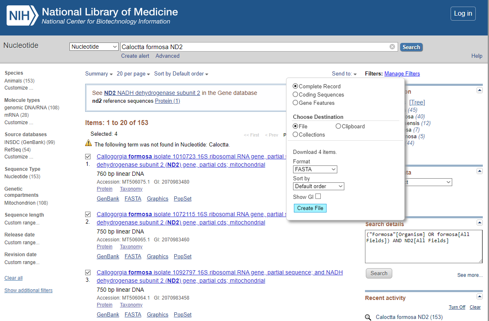
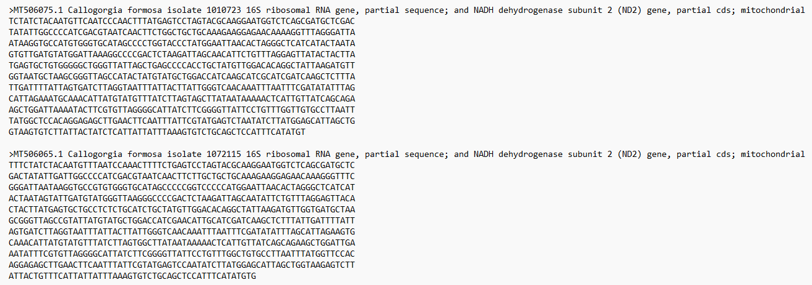

## Taller de vertebrados terrestres
### Seminario: Sistemática molecular 
#### Semestre 2025-1
#### Duración 4 hrs
#### Por: Vicente J. Castillo Chora

## Parte 2
- Buenas prácticas bioinformáticas.
- Práctica 1: Descargar y dar formato a los datos.
- Visualización y edición / conversión entre formatos.
- Práctica 2: Hacer y discutir un árbol filogenético.
- Práctica 3: Hacer y discutir una red de haplotipos.
- Discusión sobre reproducibilidad y disponibilidad del código y los datos.

### 2.1. Buenas prácticas bioinformáticas.

**Ventajas**
- Reproducibilidad.
- Incrementar los datos disponibles.
- Reanalizar los datos ante nuevos enfoques / softwares / algoritmos.
- Complementar análisis previos.

**Elementos a considerar**
- Orden.
- Documentar.
- Compatibilidad entre versiones.

### 2.2. Práctica 1: Descargar y dar formato a los datos.

Para este ejercicio voy a tratar de reproducir los resultados de [Sánchez-González et al., 2021]. 

**Fuentes de datos**\
[GeneBank](https://www.ncbi.nlm.nih.gov/genbank/)\
[DRYAD](https://datadryad.org/stash)\
Autor de correspondencia.

**Descarga de los datos**\
- Buscar una especie de interés.
- Seleccionar las secuencias.
- Click en *Send file to*
- Usar formato fasta.
- Click en *Create file*.\

Va a generar un archivo de nombre *sequence* en formato **fasta**.\
Abrir en algun editor de texto plano.\
Así se ve el formato **fasta**.

Así se ve el formato **fasta** en **Mesquite**.

### Vamos a hacer lo mismo en R.

### 2.3. Visualización y edición  de las secuencias.

Los análisis filogenéticos están basados en hipótesis de homología.\
Necesitamos que las posiciones de cada nucleótido para cada individuo sean homólogas.\
Para eso recurrimos a un alineamiento.

Vamos a usar [MUSCLE](https://2018-03-06-ibioic.readthedocs.io/en/latest/install_muscle.html) \
Aquí más información. \
[Edgar, R.C. Nucleic Acids Res 32(5), 1792-97](https://www.ncbi.nlm.nih.gov/pmc/articles/PMC390337/pdf/gkh340.pdf). 

Para correr muscle necesitamos el archivo de entrada *-in* y un nombre para el archivo de salida *-out*. 

>muscle -in sequences_calocitta -out sequences_calocitta_alineamiento.fasta

Así se ve el alineamiento en formato **fasta** en **Mesquite**.

Vemos que está incompleto.\
Vamos a usar una de las secuencias de referencia para cortar las partes incompletas.

Así se ve el alineamiento editado!

### 2.4. - Práctica 2: Hacer y discutir un árbol filogenético.

Ahora vamos a tratar de estimar y representar una hipótesis filogenétca.

Vamos a convertir el alineamiento a formato nexus.\
**Nota:** Lo vamos a exportar desde mesquite.\
 *Export as simplified nexus*.\
Así se ve el formato **Nexus.**

Hay diferentes formas de estimar una filogenia. En este ejemplo vamos a emplear un enfoque bayesiano en [MrBayes.](https://nbisweden.github.io/MrBayes/download.html)

Vamos a indicar que solo tenemos una región genética mitocondrial:\
charset nd2 = 1-636\
ploidy=haploid\
Vamos a emplear un modelo de sustitución de nucleótidos GTR, con sitios invariables y una distribución gamma:\
nst=6\
rates=invgamma\
Vamos a indicar que queremos que busque la mejor combinación de paramétros un millón de veces, que muestree cada 1000 generaciones y que descarte las primeras 200,000 como *burn-in*.\
mcmcp ngen= 1000000\ 
relburnin=yes burninfrac=0.2 printfreq=10000 samplefreq=1000 nchains=4 savebrlens=yes;\
Y finalmente que resuma los resultados de la corrida, los paraámetros y los árboles muestreados.

> begin mrbayes;\
charset nd2 = 1-636;\
set autoclose=yes nowarn=yes;\
lset nst=6 ploidy=haploid rates=invgamma;\ 
mcmcp ngen= 1000000 relburnin=yes burninfrac=0.2  printfreq=10000  samplefreq=1000 nchains=4 savebrlens=yes;\
mcmc;\
sump;\
sumt;\
end;

Así se ve el final del archivo nexus después de indicar estos parámetros para MrBayes.

Vamos a correr MrBayes con el siguiente comando.

> execute sequences_calocitta_mrbayes.nex

**Visualizar el árbol filogenético.**

Esta es el árbol de los autores

### 2.5.- Práctica 3: Hacer y discutir una red de haplotipos.

#### ... En R

Este es el resultado de el ejercicio usando la librería [pegas](https://cran.r-project.org/web/packages/pegas/vignettes/PlotHaploNet.pdf).

Red de haplotipos

Esta es la red de los autores

Un poco más de contexto del artículo.\

¿A qué creen que se deben las diferencias?

### 2.6. - Discusión sobre reproducibilidad y disponibilidad del código y los datos.